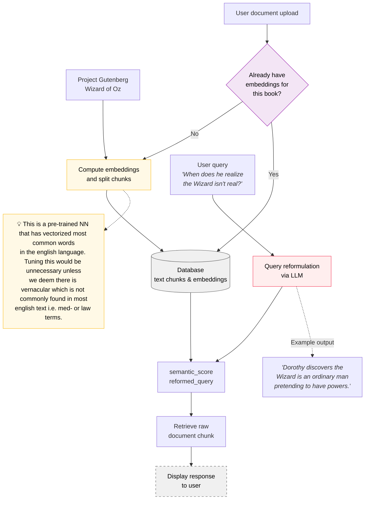

# Read it long ago? <span style="color: #6366f1;">Readiscover</span> it in seconds.

[](https://readiscover.app)
[](https://github.com/zymoncone/readiscoverers-backend/actions/workflows/pylint.yml)


## 🌐 Visit the Live Website

Check out the live app at **[readiscover.app](https://readiscover.app)**!

> **Note:** We're currently in active development. To access the app, please email **szymons@umich.edu** for the password.

## 📖 What Does Readiscover Do?

Once a user uploads their book links, we parse and chunk the texts using chapter and paragraph structure along with our tuned splitting and overlap parameters. These chunks are then embedded into vector storage for later retrieval.

When a user submits a query in natural language, a large language model reformulates it to extract context and keywords, producing a structured, search-optimized query. This enhanced query is also embedded, and the top three passages with the highest cosine similarity scores between the query embeddings and book embeddings are returned as results.

## 🛠️ Tech Stack

- **LLM:** Gemini Flash 2.0 (`gemini-2.0-flash-001`)
- **Embeddings:** Google Text Embedding (`text-embedding-005`)
- **API Framework:** FastAPI
- **HTML Parsing:** BeautifulSoup4 (bs4)
- **Deployment:** Docker + Google Cloud Run
- **Vector Storage:** In-memory with pandas DataFrames

## 🔍 Architectural Diagram for Semantic Retriever



## 📡 API Documentation

The backend exposes the following REST API endpoints:

### `POST /v1/book-data`
Process and index a book from a URL (Project Gutenberg supported).

**Request Body:**
```json
{
  "url": "https://www.gutenberg.org/cache/epub/55/pg55-images.html",
  "target_chunk_size": 1200,
  "sentence_overlap": 3,
  "small_paragraph_length": 300,
  "small_paragraph_overlap": 3
}
```

**Response:**
```json
{
  "status": "success",
  "filename": "uuid-generated-filename",
  "book_title": "The Wonderful Wizard of Oz",
  "book_author": "L. Frank Baum",
  "message": "Book data processed and saved."
}
```

### `POST /v1/model-response`
Convert a natural language query into an optimized search query using LLM.

**Request Body:**
```json
{
  "user_query": "When does he realize the Wizard isn't real?"
}
```

**Response:**
```json
{
  "status": "success",
  "search_query": "Dorothy discovers the Wizard is an ordinary man pretending to have powers.",
  "keywords": ["Wizard", "discover", "ordinary man", "pretend", "powers"]
}
```

### `POST /v1/search-response`
Search for relevant passages across indexed books using semantic similarity.

**Request Body:**
```json
{
  "query": "Dorothy discovers the Wizard is an ordinary man",
  "filenames": ["uuid-generated-filename"],
  "top_k": 3,
  "query_id": "unique-query-id",
  "enhanced_query": true,
  "keywords": ["Wizard", "discover", "ordinary man"]
}
```

**Response:**
```json
{
  "status": "success",
  "search_results": [
    {
      "text": "Passage text...",
      "similarity_score": 0.67,
      "book_title": "The Wonderful Wizard of Oz",
      "book_author": "L. Frank Baum",
      "chapter": 9,
      "chunk_index": 101
    }
  ]
}
```

## 🚀 Running Locally

### Prerequisites

1. **Install Docker**
   - Download and install [Docker Desktop](https://www.docker.com/products/docker-desktop/)

2. **Install Google Cloud CLI**
   - Download and install the [gcloud CLI](https://cloud.google.com/sdk/docs/install)
   - After installation, initialize gcloud:
     ```bash
     gcloud init
     ```
   - Authenticate with your Google account:
     ```bash
     gcloud auth login
     gcloud auth application-default login
     ```

### Build locally with docker

Build a new docker image and spin up container in local environment.

```bash
docker compose up --build
```